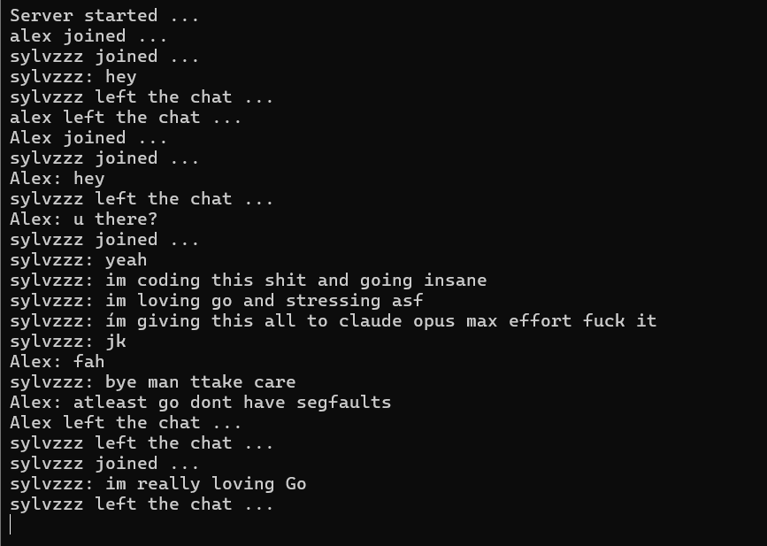
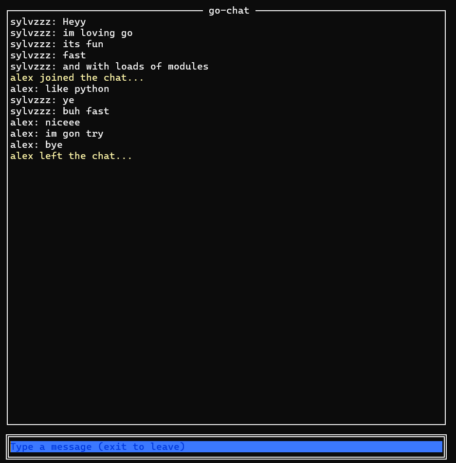
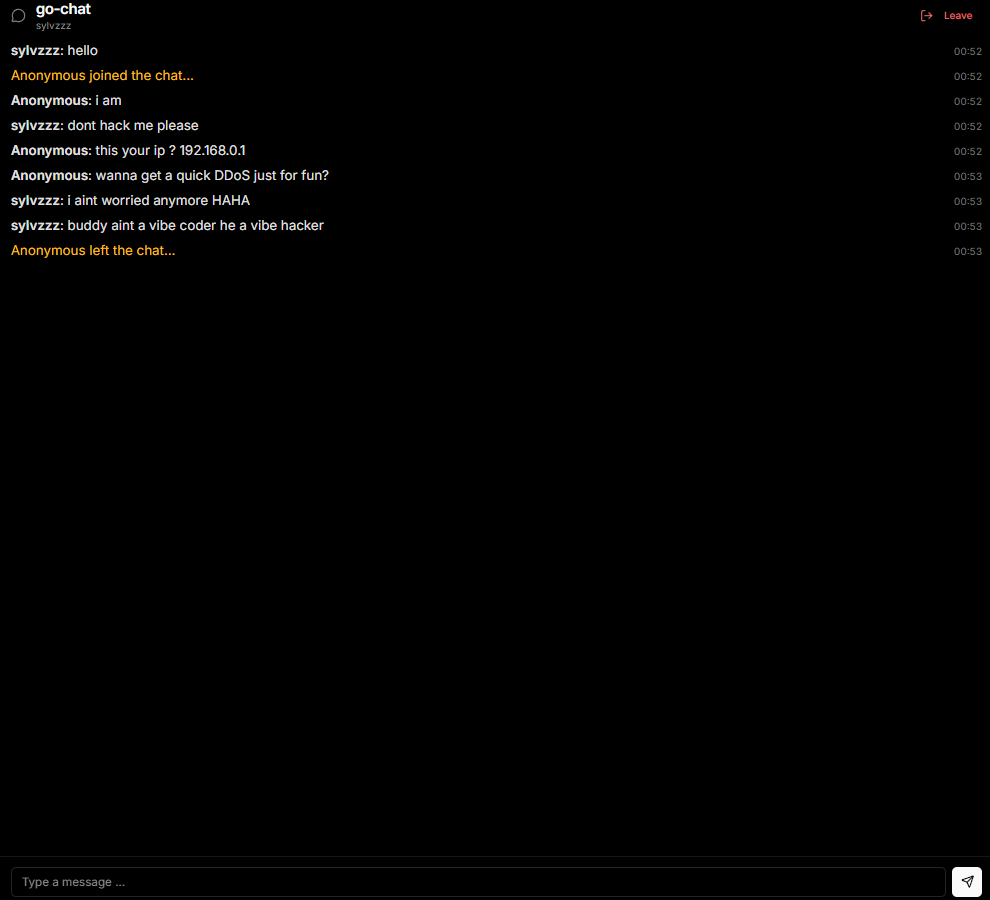

# go-chat

A TCP chat server and client written in Go, using only the standard library and the `sync` package.

## Server

## Client - TUI

## Web Interface


## Layout

- `server/` - the chat server. Listens on `:8080`, accepts clients, and broadcasts each message to everyone else in the room.
- `client/` - a terminal UI (TUI) client built with [tview](https://github.com/rivo/tview). Connects to the server, asks for a username, lets you type messages in an input box at the bottom, and prints incoming messages to the scrolling pane above. `Esc` to quit is handled by the input focus (`Enter` to send, type `exit` to leave).

Both are separate programs with their own `go.mod`.

## What I learned

This was my first Go project and my first contact with the language. I already had a good knowledge of Networking but at concept level, for example my only "project" was NetPractice from 42 Lisbon, but real network programming no, this was also new ground for me.

## What i loved about Go

- Goroutines and channels, and how they let each client run in parallel without blocking the others. A client sends its message on a channel, a central broadcast goroutine receives it and fans it out to everyone else.
- And what i liked the most and probably made me even do a project in go was the language being compiled and fast like C while having readability and Standard Library nearly as good as Python
- Being able to combine concurrency and systems progamming with network programming.
- The `net` side: `Listen`, `Accept`, `Dial`, and `Conn` for the connection itself, plus `bufio.Scanner` for reading line by line.

## Running

Open a terminal to start a server. Port `8080` must be free before you start; if an old server is still running, the new one fails to bind and prints an error.

Compiling the programs:

```bash
make compile
# or
make
```

Terminal 1 (server):

```bash
make server
```

Terminal 2:

```bash
# Chat interface in the terminal
make tui

# Chat interface as a Web Application
make web
```

Wait for the username prompt, type a name, then start chatting. Type `exit` to leave if your on the TUI.

## Example output

Server terminal with two clients connected, one of them saying hello:

```text
Server started ...
alice joined ...
bob joined ...
alice: hey everyone
bob: hi alice
alice left the chat ...
```

Client terminal for bob:

```text
Enter your username: bob
hi alice
```
